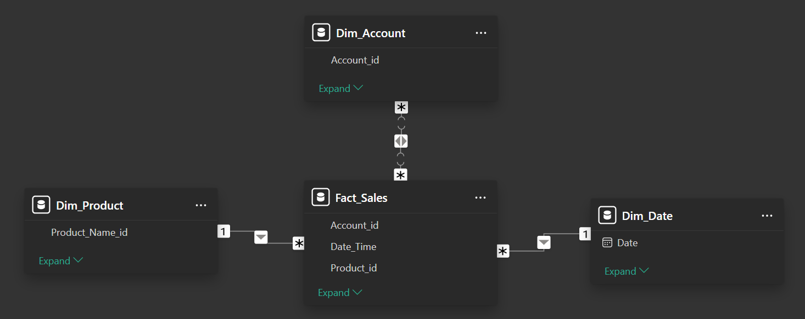

This project demonstrates the creation of an interactive and dynamic sales performance report using Power BI, based on a sample dataset for a fictional plant company.

### 1. Data

The project utilizes a three-tab Excel file (dataset.xls) as its data source:

-   **Plant\_FACT:**  This is the core transactional dataset, recording each sales invoice with details like product ID, sales amount, quantity, price, cost of goods sold, date and time of sale, and customer account ID.  
**Purpose:**  This data forms the foundation of sales analysis, allowing us to understand revenue trends, product performance, and customer buying behavior.
-   **Accounts:**  This table acts as a customer directory, containing information on each unique account, such as country code, account ID, location details (latitude, longitude), and address information.  
**Purpose:** Customer segmentation and geographical analysis become possible with this data, enabling targeted marketing and regional performance evaluation. 

-   **Plant\_Hierarchy:** This table outlines the product categorization structure, enabling a multi-level view of product families, groups, names, sizes, and types.  
**Purpose:**  Analyzing sales performance by product categories becomes possible, leading to insights on which product categories are driving sales or require attention.

### 2. Data Import and Transformation in Power BI

1.  **Import Data:**  Begin by importing the three Excel sheets into Power BI using the "Get Data" functionality.
2.  **Power Query Editor:** Transform and clean the data using Power Query. This involves: 
    *   Renaming Tables: 
        - We will be using a Star Schema data model (Fact Tables for core transactional data. In this case, Fact_Sales contains the sales transactions. Dimension Tables for descriptive attributes that provide context to the fact table, in this case information about accounts and products) 
        - Change table names to be more descriptive (e.g., Plant\_FACT to Fact_Sales, Accounts to Dim_Account, and Plant\_Hierarchy to Dim_Product).
    *   Modifying Column Titles: 
        - Improve clarity by adjusting column names (e.g., "latitude2" to "Latitude", "Country 2" to "Country").
    *   Data Type Validation: 
        - Ensure columns have the correct data types (e.g., Date\_Time as Date).
    *   Removing Duplicates: 
        - Cleanse the Dim_Product and Dim_Account tables by removing duplicate entries based on their unique identifiers (Product\_Name for Dim_Product and Account\_id for Dim_Account).

### 3. Data Modeling

1.  **Create Date Table:** Generate a dedicated date table (Dim_Date) using the `CALENDAR` function in DAX. Populate it with a date range covering the sales data. This table will be essential for time intelligence calculations. `Dim_Date = CALENDAR (DATE (2022, 1, 1), DATE(2024, 12,31))`   
**Purpose:** A separate date table provides a structured way to analyze sales trends over time, enabling year-over-year comparisons and trend identification. 

2.  **Add "Inpast" Column to Dim_Date:** Create a calculated column named "Inpast" in the Dim_Date table using DAX. This column flags dates as TRUE if they fall within the past year's sales data range (if the date is 12 or more months older than the most recent sales date).   
    ```
    Inpast = 
    VAR lastsalesdate = MAX(Fact_Sales[Date_Time])
    VAR lastsalesdatePY = EDATE(lastsalesdate,-12)
    RETURN
    Dim_Date[Date]<= lastsalesdatePY
    ```
  **Purpose:** The "Inpast" flag becomes crucial when calculating prior-year-to-date (PYTD) measures, ensuring only relevant months are compared, especially for incomplete years.

3.  **Create Values Table:** Create a new table called "Slc_Values" (Slicer) with a single column "Values". Populate this column with the values: "Sales", "Gross Profit", and "Quantity". **Purpose:** This table will serve as the basis for a slicer, allowing users to dynamically switch between these key metrics in the visualizations.

4.  **Establish Relationships:** Define relationships between the tables based on common fields. For example:
    *   Connect Fact_Sales and Dim_Account using Account\_id.
    *   Connect Fact_Sales and Dim_Date using Date\_Time.
    *   Connect Fact_Sales and Dim_Product using Product\_id.  
    
    
    **Purpose:**  Connecting the tables through relationships is essential for Power BI to understand the links between different data points, enabling combined analysis and accurate calculations.

### 4. DAX Measure Creation

Create a dedicated "Measures" table to house all your DAX measures

1.  **Base Measures:**  Begin by creating simple SUM measures for:
    *   Sales: `Sales = SUM(Fact_Sales[Sales_USD])`
    *   Quantity: `Quantity = SUM(Fact_Sales[Quantity])`
    *   Cost of Goods Sold: `COGs = SUM(Fact_Sales[COGS_USD])`
    *   Gross Profit: `Gross Profit = [Sales]-[COGs]`
2.  **Prior Year-to-Date Measures:**  Utilize the `SAMEPERIODLASTYEAR` DAX function with the "Inpast" flag from the date table to calculate PYTD values for:
    *   Sales: `PYTD_Sales = CALCULATE([Sales], SAMEPERIODLASTYEAR(Dim_Date[Date]), Dim_Date[Inpast] = TRUE)`
    *   Quantity: `PYTD_Quantity = CALCULATE([Quantity], SAMEPERIODLASTYEAR(Dim_Date[Date]), Dim_Date[Inpast] = TRUE)`
    *   Gross Profit:  `PYTD_GrossProfit = CALCULATE([Gross Profit], SAMEPERIODLASTYEAR(Dim_Date[Date]), Dim_Date[Inpast] = TRUE)`
3.  **Year-to-Date Measures:**  Use the `TOTALYTD` DAX function to calculate YTD values for:
    *   Sales:  `YTD_Sales = TOTALYTD([Sales],Fact_Sales[Date_Time])` 
    *   Quantity:  `YTD_Quantity = TOTALYTD([Quantity],Fact_Sales[Date_Time])`
    *   Gross Profit:  `YTD_GrossProfit = TOTALYTD([Gross Profit],Fact_Sales[Date_Time])`
4.  **Switch Measures:** Create two dynamic switch measures to allow users to select between Sales, Quantity, or Gross Profit for both YTD and PYTD comparisons: 
    *   Switch PYTD: 
        ```js
        S_PYTD = 
        VAR selected_value = SELECTEDVALUE(Slc_Values[Values])
        VAR result = SWITCH(selected_value,
            "Sales", [PYTD_Sales],
            "Quantity", [PYTD_Quantity],
            "Gross Profit", [PYTD_GrossProfit],
            BLANK()
        )
        RETURN
        result          
        ```
    *   Switch YTD:
        ```js
        S_YTD = 
        VAR selected_value = SELECTEDVALUE(Slc_Values[Values])
        VAR result = SWITCH(selected_value,
            "Sales", [YTD_Sales],
            "Quantity", [YTD_Quantity],
            "Gross Profit", [YTD_GrossProfit],
            BLANK()
        )
        RETURN
        result
        ```
5.  **Comparison Measure:**  Calculate the difference between YTD and PYTD values based on the user selection from the slicer: `YTD vs PYTD = [S_YTD]-[S_PYTD]`
6.  **Gross Profit Percentage:**  Calculate the gross profit margin:  `GP% = DIVIDE([Gross Profit], [Sales])`  

**Purpose:**  These DAX measures form the core analytical foundation of the report. They provide insights into sales performance, cost management, and profitability, enabling users to track trends, compare performance over time, and identify areas for improvement.

### 5. Report Design and Visualizations

1.  **Import Custom Background:** Create a visually appealing background in PowerPoint (a light background with a darker top section for header metrics), take a screenshot, and import it as the report background in Power BI. Adjust transparency for a subtle effect. **Purpose:**  A custom background provides a professional and consistent look to the report, enhancing visual appeal and brand consistency.

2.  **Header Metrics:** Utilize the new Card visual in Power BI to display key metrics. Include four cards displaying YTD Sales, PYTD Sales, YTD vs. PYTD, and GP%. Enable callout values and format the cards with rounded corners, appropriate font sizes, and a subtle gray background for visual clarity. Apply conditional formatting to the YTD vs. PYTD card, turning the font and background green for positive values and red for negative values, making it easier to identify performance trends. **Purpose:**  Clearly visible header metrics provide a quick snapshot of the company's performance at the top of the report, drawing attention to the most important figures.

3.  **Slicers:** Implement two slicers:
    *   Values Slicer (Tile Slicer): Utilize the SLC table created earlier, allowing users to dynamically switch between Sales, Gross Profit, and Quantity.  Format the slicer buttons for visual consistency and clarity.
    *   Year Slicer (Slicer): Using the Dim_Date table, create a year slicer allowing users to filter the report by year. Remove the 2022 option as it lacks PYTD data.     
    **Purpose:** Slicers provide interactivity, allowing users to explore the data from different perspectives and tailor the report to their specific needs.

4.  **Tree Map:**  Create a Tree Map to visualize the bottom 10 countries based on their YTD vs. PYTD performance. Use the "Top N" filter to dynamically select these countries based on the comparison measure. Add data labels to display the underlying values driving the performance of each country.    
**Purpose:** This visual quickly identifies underperforming regions, allowing for targeted interventions and strategy adjustments.

5.  **Waterfall Chart:** Create a Waterfall Chart to breakdown the contributors to the YTD vs. PYTD difference. Include Month (Dim_Date[Date][Month]), country, product type, and product name in the chart's hierarchy. This enables drilling down into specific products contributing to performance changes. Maintain the conventional green for increases and red for decreases for intuitive understanding.  **Purpose:**  The waterfall chart provides a clear visual explanation of how different factors contribute to the overall performance change, enabling a granular understanding of the drivers behind sales trends.

6.  **Line and Stacked Column Chart:**  Visualize YTD and PYTD trends over time using a Line and Stacked Column Chart. Place S_YTD values on the columns and S_PYTD on the line. Incorporate month and quarter in the chart's axis, allowing for different levels of date aggregation. Color the PYTD line distinctly for clear differentiation. Use product type as a legend, enabling analysis by product category within the visual.  **Purpose:** This chart offers a clear visual comparison of YTD and PYTD performance over time, highlighting seasonal trends and product category contributions to the overall sales pattern.

7.  **Scatter Chart:**  Create a Scatter Chart to analyze account profitability segmentation.  Place GP% on the Y-axis and the Switch YTD measure on the X-axis.  This allows users to visualize the profitability of different accounts based on their chosen metric (Sales, Quantity, or Gross Profit). Add average lines for both GP% and the chosen YTD metric to provide benchmarks and further segment accounts based on their position relative to these averages.  **Purpose:**  The scatter chart allows for deeper customer segmentation based on profitability, allowing for targeted sales strategies, potential customer churn prediction, and identification of high-value customer segments.

### 6. Dynamic Titles and Final Touches

1.  **Dynamic Titles:**  To maintain report relevance as users interact with the slicers create DAX measures to generate dynamic titles for visualizations.  These measures utilize the `SELECTEDVALUE` function to incorporate the user's selections from the slicers into the titles. Implement this for the Waterfall chart (`_Waterfall title = SELECTEDVALUE(Slc_Values[Values]) & " YTD vs PYTD | Month - Country - Product" `), Line and Stacked Column Chart (`_Column Chart title = SELECTEDVALUE(Slc_Values[Values]) & " YTD & PYTD | Month" `), and Scatter Chart (`_Scatter title = "Account Profitability Segmentation | GP% and " & SELECTEDVALUE(Slc_Values[Values])`).  

2.  **Report Title:** Create a dynamic report title that reflects the chosen metric from the Values slicer and the selected year (`_Report title = SELECTEDVALUE(Slc_Values[Values]) & " Performance " & SELECTEDVALUE(Dim_Date[Date].[Year])`).

3.  **Formatting and Alignment:**  Pay attention to visual consistency throughout the report. Use subtle shades of gray for backgrounds, adjust font sizes, and align visuals for a professional and clean appearance. 


